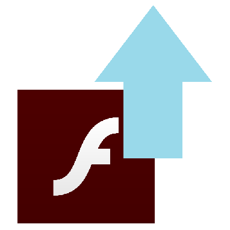

# Pull Up Flash

Click to open flash content on web pages in Flash Player. This lets you run flash games and movies you come across online in 2021 and beyond in Chromium-based browsers (Google Chrome, Edge, Brace, Vivaldi, etc.).

## Installation

### Requirements

## Installing

1. Download and run the appropriate binary for your operating system from the releases section.
2. Optionally, follow appropriate steps to make this binary run on startup.
3. Install the [Chrome Extension](https://github.com/jamesgrams/pull-up-flash-extension) in your browser.

## Building

You will need npm and Node.js installed. You will also need `pkg` installed (`npm install -g pkg`).

1. Download this repository
2. `cd` to this repository
3. Run `npm install`
4. Run `npm build`
5. The binaries will be located in the `dist` folder.

## Testing

You can simply run `npm start` after running `npm install` to test.

## Full Description

The Flash Player web plugin is no longer supported, but Flash player for desktop is still [distributed by Adobe](https://www.adobe.com/support/flashplayer/debug_downloads.html). Pull Up Flash allows you to easily run Flash content by replacing it on web pages with a button you can click to open the game or movie in Flash Player for desktop.

## Tested Sites

### Working
* https://maxgames.com
* https://crazymonkeygames.com
* https://bigdino.com
* https://onemorelevel.com
* https://andkon.com
* https://y8.com
* https://game103.net

### Not Working
* https://newgrounds.com
* https://kongregate.com

